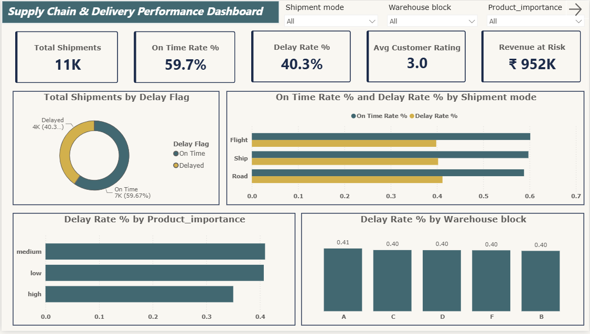
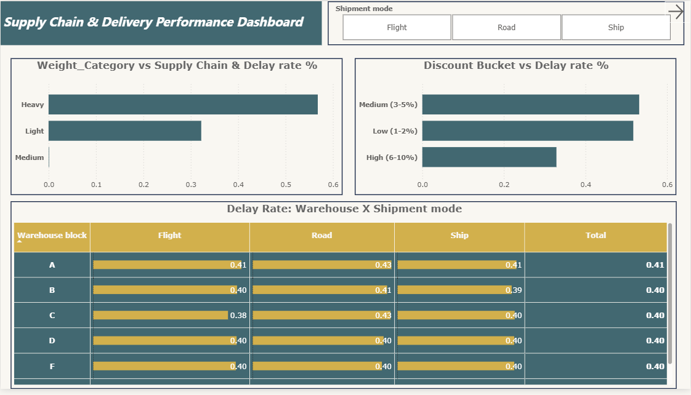
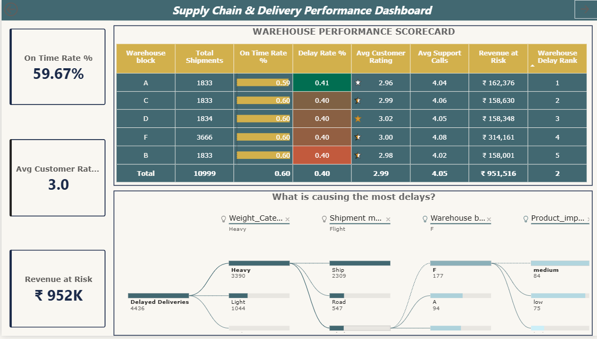
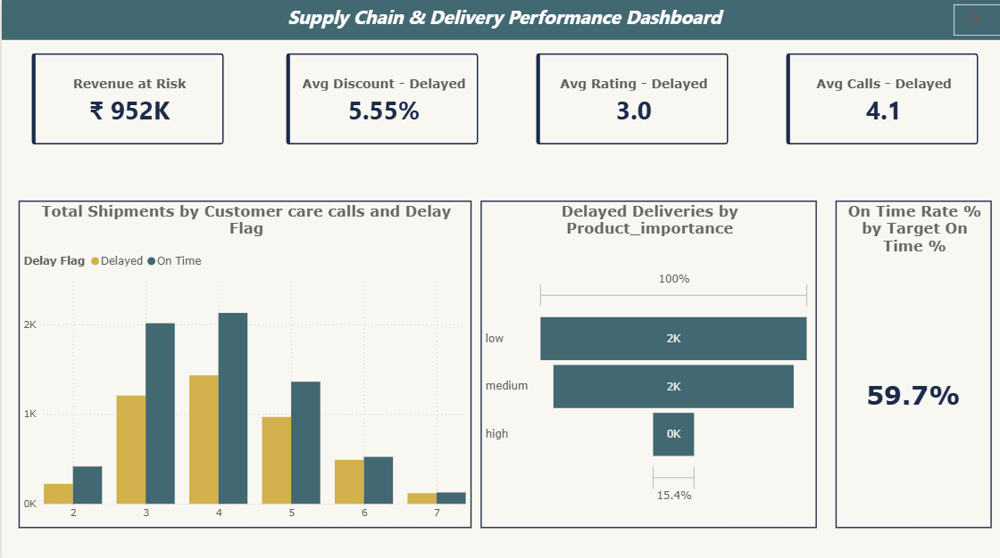

# 📦 Supply Chain & Delivery Performance Dashboard
### Power BI Analytics Project | E-Commerce Shipping Analysis

## 🎯 Problem Statement

E-commerce businesses lose revenue and customer trust due to delivery delays — yet most operations teams lack a clear, data-driven view of **where** delays happen, **why** they happen, and **what they cost**.

This dashboard analyzes **10,999 real shipment records** to answer three critical business questions:

> 1. Which warehouses and shipment modes have the highest delay rates?
> 2. What is the revenue at risk from delayed deliveries?
> 3. If we set a delivery target, are we meeting it — and by how much?

---

## 📸 Dashboard Preview

| Page | Screenshot |
|------|-----------|
| Executive Summary |  |
| Delivery Deep Dive |  |
| Warehouse Scorecard |  |
| Cost & Customer Impact |  |
| Insights & Recommendations |  |


---

## 📊 Dashboard Pages

### Page 1 — Executive Summary
One-glance overview for senior management. Shows total shipments, on-time rate, delay rate, average customer rating, and revenue at risk — broken down by shipment mode and warehouse block.

### Page 2 — Delivery Deep Dive
Root cause analysis of delays. Explores the relationship between package weight, discount level, shipment mode, and delay rate. Includes a scatter chart showing discount vs customer rating colored by delay status.

### Page 3 — Warehouse Scorecard
Performance ranking table for all 5 warehouses (A, B, C, D, F) with conditional formatting — red for worst performers, green for best. Includes a Decomposition Tree to drill into delay causes interactively. Drill-through enabled from every warehouse row.

### Page 4 — Cost & Customer Impact
Connects operational delays to business impact. Shows how delayed orders generate more support calls, lower ratings, and higher revenue at risk. Features a **What-If parameter simulator** — move the slider to set any delivery target and instantly see whether current performance meets it.

### Page 5 — Insights & Recommendations
Translates all data findings into 3 actionable business recommendations with supporting visuals. Designed for non-technical stakeholders.

---

## 🔑 Key Findings

| # | Finding | Impact |
|---|---------|--------|
| 1 | Road shipments have the **highest delay rate** of all modes despite handling the most volume | High operational risk |
| 2 | Orders with **discounts above 65%** are almost always delayed | Discount policy needs review |
| 3 | Delayed orders generate **more support calls** per shipment on average | Direct cost increase |
| 4 | **Warehouse B** is the worst performer across all 5 warehouses | Priority for intervention |
| 5 | **Package weight is NOT the main delay driver** — counter-intuitive finding | Challenges common assumptions |

---

## 🧮 DAX Measures Written

```dax
-- Core KPIs
Total Shipments        = COUNTROWS(Shipments)
On Time Deliveries     = CALCULATE(COUNTROWS(Shipments), Shipments[On_Time] = 1)
Delayed Deliveries     = CALCULATE(COUNTROWS(Shipments), Shipments[On_Time] = 0)
On Time Rate %         = DIVIDE([On Time Deliveries], [Total Shipments], 0) * 100
Delay Rate %           = DIVIDE([Delayed Deliveries], [Total Shipments], 0) * 100

-- Financial Measures
Total Revenue          = SUM(Shipments[Product_Cost])
Revenue at Risk        = CALCULATE(SUM(Shipments[Product_Cost]), Shipments[On_Time] = 0)
Avg Discount %         = AVERAGE(Shipments[Discount_offered])
Avg Discount - Delayed = CALCULATE(AVERAGE(Shipments[Discount_offered]), Shipments[On_Time] = 0)
Avg Discount - On Time = CALCULATE(AVERAGE(Shipments[Discount_offered]), Shipments[On_Time] = 1)

-- Customer Experience
Avg Customer Rating    = AVERAGE(Shipments[Customer_rating])
Avg Rating - Delayed   = CALCULATE(AVERAGE(Shipments[Customer_rating]), Shipments[On_Time] = 0)
Avg Rating - On Time   = CALCULATE(AVERAGE(Shipments[Customer_rating]), Shipments[On_Time] = 1)
Avg Support Calls      = AVERAGE(Shipments[Customer_care_calls])
Avg Calls - Delayed    = CALCULATE(AVERAGE(Shipments[Customer_care_calls]), Shipments[On_Time] = 0)

-- Ranking
Warehouse Delay Rank   = RANKX(ALL(Shipments[Warehouse_block]), [Delay Rate %],, DESC, DENSE)
Mode Delay Rank        = RANKX(ALL(Shipments[Shipment_Mode]), [Delay Rate %],, DESC, DENSE)

-- What-If Simulator
Gap to Target          = [On Time Rate %] - 'Target On Time %'[Target On Time % Value]
Gap Color              = IF([Gap to Target] >= 0, "#00C9A7", "#E24B4A")
```

**Total: 18 DAX measures**

---

## ⚙️ Advanced Power BI Features Used

| Feature | Where Used |
|---------|-----------|
| **RANKX measure** | Page 3 — warehouse performance ranking |
| **Conditional formatting (fx color)** | Page 3 scorecard, Page 4 Gap to Target card |
| **Decomposition Tree visual** | Page 3 — interactive root cause analysis |
| **Drill-through pages** | Page 3 → Page 2 (click any warehouse to drill through) |
| **KPI Visual with target** | Page 4 — on-time rate vs target |
| **Funnel chart** | Page 4 — product importance → delay funnel |
| **Filled map / clustered bar** | Page 1 — overview charts |
| **Page navigation buttons** | All pages — professional navigation bar |
| **Data bars in matrix** | Page 3 — visual scorecard bars |

---

## 🗂️ Project Structure

```
supply-chain-dashboard/
│
├── 📁 data/
│   ├── E_Commerce_Shipping_Raw.csv      ← original downloaded dataset
│   └── E_Commerce_Shipping_Clean.xlsx   ← cleaned with 3 added columns
│
├── 📁 dashboard/
│   └── SupplyChain_Dashboard.pbix       ← Power BI file (open with Power BI Desktop)
│
├── 📁 screenshots/
│   ├── page1_overview.png
│   ├── page2_deepdive.png
│   ├── page3_scorecard.png
│   ├── page4_cost_impact.png
│   └── page5_insights.png
│
├── 📁 insights/
│   └── key_findings.md                  ← detailed findings writeup
│
└── README.md
```

---

## 📦 Dataset

| Item | Detail |
|------|--------|
| Name | E-Commerce Shipping Dataset |
| Source | Kaggle — Prachi Gopalani |
| Rows | 10,999 shipments |
| Columns | 12 original + 3 engineered |
| Cost | Free — no competition rules |
| Key label | `Reached.on.Time_Y.N` (1 = On Time, 0 = Delayed) |

### Engineered columns added in Excel before loading:

| Column | Formula logic |
|--------|--------------|
| `Delay_Flag` | "Delayed" if On_Time = 0, else "On Time" |
| `Weight_Category` | Light / Medium / Heavy based on weight in grams |
| `Discount_Bucket` | No Discount / Low / Medium / High based on discount % |

---

## 🚀 How to Run This Project

### Prerequisites
- Microsoft Power BI Desktop (free) — download from microsoft.com/power-bi
- Microsoft Excel (or Google Sheets to view the data)

### Steps

```
1. Clone this repository
   git clone https://github.com/YOUR_USERNAME/supply-chain-dashboard.git

2. Open the dataset
   data/E_Commerce_Shipping_Clean.xlsx

3. Open Power BI Desktop
   File → Open → dashboard/SupplyChain_Dashboard.pbix

4. Refresh data source if prompted
   Home → Refresh → point to your local data file path

5. Explore all 5 pages using the navigation bar
```

---

## 💡 How to Use the What-If Simulator

1. Go to **Page 4 — Cost & Customer Impact**
2. Find the **"What-If Simulator"** section (bottom right)
3. Move the **"Set Target On-Time Delivery %"** slider
4. Watch the **Gap to Target** card:
   - 🟢 **Green** = current performance meets your target
   - 🔴 **Red** = current performance is below your target
5. Use the **Warehouse** slicer to filter to a specific warehouse
6. The **Revenue at Risk** card updates to show that warehouse's delayed order value

---

## 🎯 Business Recommendations

Based on the analysis, three actions are recommended:

**1. Shift high-importance products to Flight mode**
> Road handles the most volume but has the highest delay rate. For products flagged as High importance, switching to Flight reduces delay risk significantly.

**2. Audit Warehouse B immediately**
> Warehouse B has the highest delay rate and lowest customer rating across all warehouses. An operational audit to identify process bottlenecks is the highest-priority action.

**3. Cap discounts at 50% during high-volume periods**
> Orders with discounts above 65% show near-100% delay rates — suggesting aggressive discounting strains fulfillment capacity. Capping discounts during peak periods can reduce delays without significant revenue impact.

---

## 🛠️ Tools & Technologies

| Tool | Purpose |
|------|---------|
| Power BI Desktop | Dashboard building and DAX |
| Power Query | Data cleaning and transformation |
| DAX | 18 custom measures |
| Microsoft Excel | Initial data cleaning and column engineering |
| Power BI Service | Cloud publishing and sharing |

---

## 📈 Project Timeline

| Week | Work Done |
|------|-----------|
| Week 1 | Dataset download, Excel cleaning, Power BI load, all 18 DAX measures |
| Week 2 | Pages 1, 2, 3 — all visuals, slicers, drill-through |
| Week 3 | Pages 4, 5 — What-If simulator, Insights page, full formatting and theme |
| Week 4 | Power BI Service publish, GitHub repo setup, README, screenshots |

---

## 👤 Author

Kishor kumar S
B.E Computer Science · 2026

📧 kishorkumars2304@gmail.com
🔗 [LinkedIn](https://linkedin.com/in/kishor-kumar-sugumar)
🐙 [GitHub](https://github.com/kishorkumar23)


---

## 📄 License

MIT License — free to use, modify, and share with attribution.

---

> ⭐ If you found this project useful, please give it a star on GitHub!
